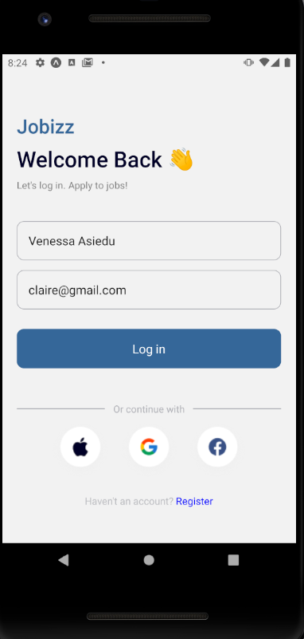

# rn-assignment4-11157784
# DCIT202 Assignment 4

##Project Overview
This project entails crafting a mobile application using React Native that closely adheres to a predefined visual layout. The user journey commences with a login screen where individuals input their name and email. Upon successful authentication, users are seamlessly transitioned to a home screen where their personal details are prominently showcased. Furthermore, the home screen features dedicated sections for both popular and featured job listings.
## Screenshots

### Login Screen

### Home Screen

### Popular Job Cards

### Featured Job Cards

## Components

### LoginScreen
- *Usage:* To capture user's name and email.
- *Props:* None
- *Functionality:* On submit, navigates to HomeScreen passing name and email as params.

### HomeScreen
- *Usage:* Displays user's name and email, and lists popular and featured job cards.
- *Props:* Receives name and email via navigation params.
- *Functionality:* Renders PopularJobCard and FeaturedJobCard components with details.

### PopularJobCard
- *Usage:* Displays details of a popular job.
- *Props:* title, company, location
- *Functionality:* Renders a card with job details.

### FeaturedJobCard
- *Usage:* Displays details of a featured job.
- *Props:* title, company, location
- *Functionality:* Renders a card with job details.

## Running the App
1. Clone the repository to your local machine.
2. Navigate to the project directory:
    
    cd rn-assignment4-11024002
    
3. Install the dependencies:
    
    npm install
    
4. Start the application:
    
    expo start
    
5. Use the Expo CLI to run the app on an iOS simulator, Android emulator, or physical device.
